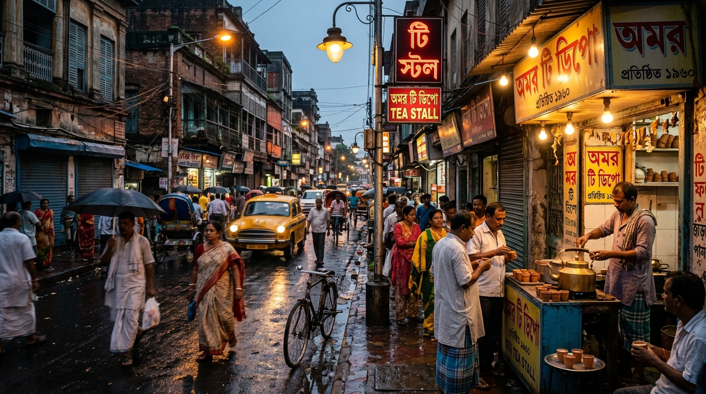

# ☕ Adda (আড্ডা) - Lofi & Cafe Vibes

**Adda** is an immersive Progressive Web App (PWA) designed to capture the essence of a traditional Bengali "Adda" — a timeless cultural tradition of free-flowing, intellectual, and informal conversation over tea. 

This application provides a focused, aesthetic environment featuring curated Lofi/Cafe music, dynamic ambient backgrounds, and interactive features built purely with Vanilla HTML, CSS, and JavaScript.



## 🌟 Key Features

* **🎧 Curated Music Player:** Integrated seamlessly with the YouTube IFrame API to play continuous, ad-free ambient playlists (Indie Hits, Bengali Melodies, Retro Classics, and Requested Songs).
* **🌅 Dynamic Day/Night Cycle:** The background seamlessly transitions between Kolkata day and night scenes based on the user's actual local time clock.
* **🌧️ Interactive Ambience:** Built-in rain overlays and ambient audio toggles to create the perfect cozy vibe.
* **💬 Live Chat Interface:** A built-in chat UI (currently mocked, ready for Firebase integration) to simulate the classic "Adda" group experience.
* **🧠 Adda Trivia Cycler:** Learn the deep history of Kolkata's Coffee House, rock adda culture, and Bengali traditions via the rotating trivia engine.
* **📱 Progressive Web App (PWA):** Fully installable on iOS, Android, and Desktop via `manifest.json` and service workers for a native app-like experience.

## 🚀 Tech Stack

* **Frontend:** Vanilla HTML5, CSS3, JavaScript (ES6)
* **Icons:** Phosphor Icons
* **Media:** YouTube IFrame API
* **Architecture:** Progressive Web App (PWA) — No frameworks (Zero-dependency footprint).

## 🛠️ Local Development

Getting started is incredibly easy since the app does not rely on Node.js or any modern build tools.

1. **Clone the repository:**
   ```bash
   git clone https://github.com/santanumajumdar/Adda.git
   cd Adda
   ```
2. **Serve the app locally:**
   You can use any local web server to run the app.
   ```bash
   # Using Python
   python3 -m http.server 3000
   
   # Or using npx
   npx serve .
   ```
3. **Open in Browser:** Navigate to `http://localhost:3000`.

## 📂 File Structure

* `index.html` - The core application shell and layout.
* `style.css` - Custom styling, glassmorphism UI, and CSS animations.
* `app.js` - Logic for the dynamic clock, YouTube player, chat, and trivia cycler.
* `sw.js` & `manifest.json` - PWA configuration and offline caching logic.
* `*.jpg` - High-resolution, optimized background assets.

## 🤝 Contributing
Contributions, issues, and feature requests are welcome! If you'd like to implement real-time chat via Firebase or add new Lofi playlists, feel free to open a Pull Request.

---
*Built with ❤️ for the love of Cha and Adda.*
